# Kalimu (in production)

> Icon by [Flaticon](https://www.flaticon.com/free-icon/notepad_7329446)

## Overview

Kalimu is an AI-powered educational platform designed to support high school students throughout their academic journey. By integrating artificial intelligence, we provide comprehensive assistance with academic planning, college preparation, student life, and personal development.

## System Architecture

```mermaid
graph TD
    A[Kalimu] --> B[Academic Planning]
    A --> C[College Preparation]
    A --> D[Student Life]
    A --> E[Personal Development]

    B --> B1[Course Selection Helper]
    B --> B2[GPA Calculator & Tracker]
    B --> B3[Study Schedule Optimizer]
    B --> B4[Homework Manager]
    B --> B5[Test Prep Assistant]
    B --> B6[Academic Progress Tracker]

    C --> C1[College Matcher]
    C --> C2[Admission Tips]
    C --> C3[Scholarship Finder]
    C --> C4[Common App Helper]
    C --> C5[College Visit Planner]

    D --> D1[Club & Activity Recommender]
    D --> D2[Sports Management]
    D --> D3[Volunteer Opportunity Finder]
    D --> D4[Leadership Development]
    D --> D5[Competition Tracker]

    E --> E1[Career Interest Explorer]
    E --> E2[Summer Program Finder]
    E --> E3[Skill Development Path]
    E --> E4[Mental Health Resources]
    E --> E5[Time Management Coach]

    classDef default fill:#6a0dad,stroke:#4b0082,stroke-width:2px;
    class A,B,C,D,E default;

```

## Features

### 📚 Academic Planning

- **Course Selection Helper:** Smart course recommendations based on interests and requirements
- **GPA Calculator & Tracker:** Real-time GPA monitoring and forecasting
- **Study Schedule Optimizer:** AI-powered study planning
- **Homework Manager:** Assignment tracking and deadline management
- **Test Prep Assistant:** Personalized test preparation support
- **Academic Progress Tracker:** Graduation requirement monitoring

### 🎓 College Preparation

- **College Matcher:** Personalized college recommendations
- **Admission Tips:** Strategic guidance for college applications
- **Scholarship Finder:** Comprehensive scholarship database and matching
- **Common App Helper:** Step-by-step application assistance
- **College Visit Planner:** Campus visit organization tools

### 🌟 Student Life

- **Club & Activity Recommender:** Personalized extracurricular suggestions
- **Sports Management:** Athletic activity tracking
- **Volunteer Opportunity Finder:** Service opportunity matching
- **Leadership Development:** Leadership role identification
- **Competition Tracker:** Academic competition management

### 🚀 Personal Development

- **Career Interest Explorer:** Early career guidance
- **Summer Program Finder:** Enrichment opportunity matching
- **Skill Development Path:** Customized learning roadmaps
- **Mental Health Resources:** Wellness support and resources
- **Time Management Coach:** Schedule optimization tools

## Technical Stack

- **AI Engine:** Google's Gemini API
- **Core Capabilities:**
  - Natural language processing for personalized interactions
  - Machine learning for smart recommendations
  - Real-time data processing for academic tracking

## Getting Started

[Unfinished]

## Contributing

[Unfinished]

## License

[Unfinished]

---
Made with ❤️ for students
